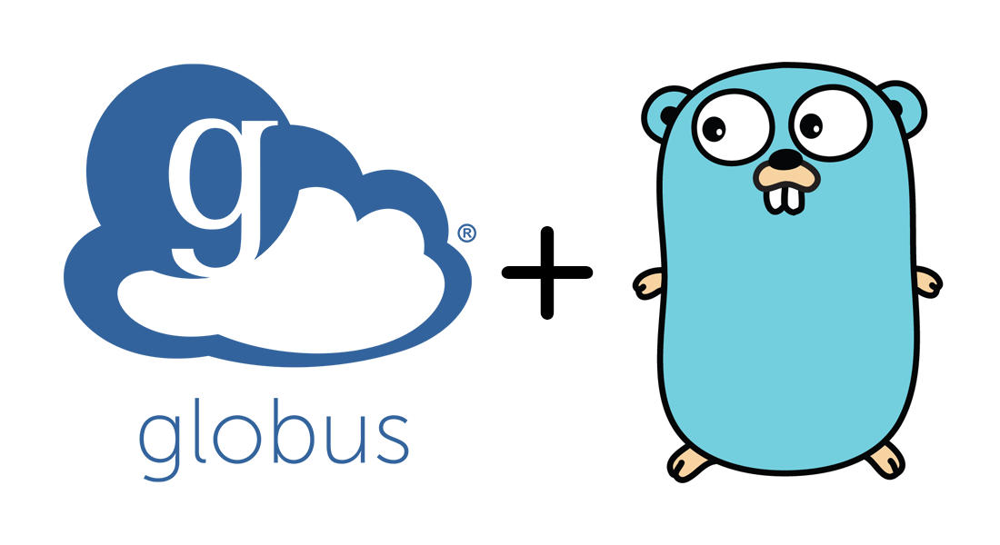

# SPDX-License-Identifier: Apache-2.0
# SPDX-FileCopyrightText: 2025 Scott Friedman and Project Contributors

<p align="center">
  
</p>

<h1 align="center">Globus Go SDK</h1>

<p align="center">
  <a href="https://pkg.go.dev/github.com/scttfrdmn/globus-go-sdk/v3"></a>
  <a href="https://goreportcard.com/report/github.com/scttfrdmn/globus-go-sdk/v3"></a>
  <a href="https://github.com/scttfrdmn/globus-go-sdk/actions/workflows/go.yml"></a>
  <a href="LICENSE"></a>
  <a href="https://github.com/scttfrdmn/globus-go-sdk/releases"></a>
  <a href="https://codecov.io/gh/scttfrdmn/globus-go-sdk"></a>
</p>

A Go SDK for interacting with Globus services, providing a simple and idiomatic Go interface to Globus APIs.

> **STATUS**: **v3.65.0-1** is production-ready! ✅ Synchronized with Python SDK v3.65.0. **v4.5.0-1** is available with full v4.5.0 feature parity for early adopters. See [Version Guide](#-version-guide) below.

> **DISCLAIMER**: The Globus Go SDK is an independent, community-developed project and is not officially affiliated with, endorsed by, or supported by Globus, the University of Chicago, or their affiliated organizations. This SDK is maintained by independent contributors and is not a product of Globus or the University of Chicago.

## 🚀 Version Guide

**Choose the right version for your needs:**

| Version | Status | When to Use | Installation |
|---------|--------|-------------|--------------|
| **v3.65.0-1** | ✅ **Production Ready** | All production applications | `go get github.com/scttfrdmn/globus-go-sdk/v3` |
| **v4.5.0-1** | 🔶 Early Adopters | Testing v4 features, non-critical apps | `go get github.com/scttfrdmn/globus-go-sdk/v4` |

**v3 Features:** Connection pooling, rate limiting, token storage, comprehensive tests
**v4 Features:** Context-first API, explicit scopes, Close() methods, GCS downloads, device auth, action providers, full test coverage

**Recommendation:** Use **v3** for production. Try **v4** for new projects if you want the latest API design.

## 📚 Documentation

**[Read the full documentation](https://scttfrdmn.github.io/globus-go-sdk/)**

- [Installation Guide](https://scttfrdmn.github.io/globus-go-sdk/getting-started/installation/)
- [Quick Start](https://scttfrdmn.github.io/globus-go-sdk/getting-started/quickstart/)
- [API Reference](https://scttfrdmn.github.io/globus-go-sdk/api/)
- [Code Examples](https://scttfrdmn.github.io/globus-go-sdk/examples/transfer/)

## 📖 API Documentation

**Complete API documentation is available at [pkg.go.dev](https://pkg.go.dev/github.com/scttfrdmn/globus-go-sdk/v3)**

### Service-Specific Documentation

- **[Core SDK](https://pkg.go.dev/github.com/scttfrdmn/globus-go-sdk/v3/pkg)** - Main SDK entry point and configuration
- **[Authentication](https://pkg.go.dev/github.com/scttfrdmn/globus-go-sdk/v3/pkg/services/auth)** - OAuth2 flows, token management, MFA support
- **[Groups](https://pkg.go.dev/github.com/scttfrdmn/globus-go-sdk/v3/pkg/services/groups)** - Group and membership management operations
- **[Transfer](https://pkg.go.dev/github.com/scttfrdmn/globus-go-sdk/v3/pkg/services/transfer)** - File transfer with resumable and recursive support
- **[Search](https://pkg.go.dev/github.com/scttfrdmn/globus-go-sdk/v3/pkg/services/search)** - Advanced search with query building and pagination
- **[Flows](https://pkg.go.dev/github.com/scttfrdmn/globus-go-sdk/v3/pkg/services/flows)** - Automation workflows and batch operations
- **[Compute](https://pkg.go.dev/github.com/scttfrdmn/globus-go-sdk/v3/pkg/services/compute)** - Function execution and endpoint management
- **[Timers](https://pkg.go.dev/github.com/scttfrdmn/globus-go-sdk/v3/pkg/services/timers)** - Timer and scheduling services
- **[Tokens](https://pkg.go.dev/github.com/scttfrdmn/globus-go-sdk/v3/pkg/services/tokens)** - Token introspection and validation

## Features

- **Authentication**: OAuth2 flows with token management and automatic refreshing
- **Token Management**: Complete token lifecycle management with automatic refreshing
- **Token Storage**: Persistent token storage (memory and file-based implementations)
- **Groups**: Group management and membership operations
- **Transfer**: File transfer with recursive directory support and resumable transfers
- **Search**: Advanced search capabilities with query building and pagination
- **Flows**: Automation workflows with batch operations
- **Compute**: Function execution, endpoint management, workflows, and task groups
- **Performance**: Connection pooling, rate limiting, and backoff strategies
- **Observability**: Structured logging and distributed tracing
- **Reliability**: Comprehensive error handling with retries and circuit breakers
- **Compatibility**: API version compatibility checking and management
- **Integration**: Extensive testing infrastructure
- **Examples**: CLI, token management, compute workflows, and web application examples
- **Utilities**: Verification tools to test credentials

## Installation

### Requirements

- Go 1.18 or higher (uses generics for some utility functions)
- No external dependencies except for testing

### Using `go get`

```bash
go get github.com/scttfrdmn/globus-go-sdk/v3
```

### Using Go modules in your project

```go
// v3 (Production - Recommended)
import "github.com/scttfrdmn/globus-go-sdk/v3/pkg"

// v4 (Early Adopters)
import "github.com/scttfrdmn/globus-go-sdk/v4/pkg/core"
```

## Testing with Globus Credentials

This SDK includes a standalone credential verification tool to test your Globus credentials:

```bash
# Clone the repository
git clone https://github.com/scttfrdmn/globus-go-sdk.git
cd globus-go-sdk

# Copy the example .env.test file and add your credentials
cp .env.test.example .env.test
# Edit .env.test with your favorite editor and add your credentials

# Build and run the verification tool
cd cmd/verify-credentials
go build
./verify-credentials
```

### Comprehensive Testing

For complete SDK testing, including all services with real credentials:

```bash
# After setting up your .env.test file
./scripts/comprehensive_testing.sh  # Run all tests with real credentials
```

This script runs all unit tests, examples, integration tests, and verifies all services work with your real credentials. Results are logged to `comprehensive_testing.log`.

See [doc/COMPREHENSIVE_TESTING.md](doc/COMPREHENSIVE_TESTING.md) for detailed testing guidelines.

### Integration Testing

For targeted integration testing:

```bash
# After setting up your .env.test file
./scripts/run_integration_tests.sh --verify  # Verify credentials only
./scripts/run_integration_tests.sh           # Run all integration tests
```

See [doc/INTEGRATION_TESTING.md](doc/INTEGRATION_TESTING.md) for more details on integration testing with credentials.

## SDK Organization

This SDK follows the structure and patterns established by the official Globus Python and JavaScript SDKs. It is organized into service-specific packages that each provide clients for interacting with Globus services.

### Core Components

- `pkg/core`: Base client functionality, error handling, logging, etc.
- `pkg/core/authorizers`: Authentication mechanisms
- `pkg/core/transport`: HTTP transport layer
- `pkg/core/config`: Configuration management

### Services

- `pkg/services/auth`: OAuth2 authentication and authorization
- `pkg/services/tokens`: Token management with storage and automatic refreshing
- `pkg/services/groups`: Group management
- `pkg/services/transfer`: File transfer and endpoint management
- `pkg/services/search`: Data search and discovery
- `pkg/services/flows`: Automation and workflow orchestration
- `pkg/services/compute`: Distributed computation and function execution

## Quick Start

### Simple Transfer Example (v3)

```go
package main

import (
    "context"
    "fmt"
    "log"

    "github.com/scttfrdmn/globus-go-sdk/v3/pkg/core/authorizers"
    "github.com/scttfrdmn/globus-go-sdk/v3/pkg/services/transfer"
)

func main() {
    // Create an authorizer with your access token
    authorizer := authorizers.StaticTokenCoreAuthorizer("your-access-token")

    // Create a transfer client
    client, err := transfer.NewClient(
        transfer.WithAuthorizer(authorizer),
    )
    if err != nil {
        log.Fatal(err)
    }

    // List your endpoints
    endpoints, err := client.ListEndpoints(context.Background(), nil)
    if err != nil {
        log.Fatal(err)
    }

    fmt.Printf("Found %d endpoints\n", len(endpoints.Data))
}
```

### Simple Transfer Example (v4 with Close())

```go
package main

import (
    "context"
    "fmt"
    "log"

    "github.com/scttfrdmn/globus-go-sdk/v4/pkg/core"
    "github.com/scttfrdmn/globus-go-sdk/v4/pkg/services/transfer"
)

func main() {
    ctx := context.Background()

    // Create config with explicit scopes
    config := &core.Config{
        AccessToken: "your-access-token",
        Scopes:      []string{core.Scopes.TransferAll},
    }

    // Create transfer client
    client, err := transfer.NewClient(ctx, config)
    if err != nil {
        log.Fatal(err)
    }
    defer client.Close() // Clean up resources

    // Use the client...
    fmt.Println("Client ready!")
}
```

### Authentication with Token Management (v3)

func main() {
    // Create a token storage for persisting tokens
    storage, err := tokens.NewFileStorage("~/.globus-tokens")
    if err != nil {
        log.Fatalf("Failed to create token storage: %v", err)
    }
    
    // Create a new SDK configuration
    config := pkg.NewConfigFromEnvironment().
        WithClientID(os.Getenv("GLOBUS_CLIENT_ID")).
        WithClientSecret(os.Getenv("GLOBUS_CLIENT_SECRET"))

    // Create a new Auth client
    authClient, err := config.NewAuthClient()
    if err != nil {
        log.Fatalf("Failed to create auth client: %v", err)
    }
    authClient.SetRedirectURL("http://localhost:8080/callback")
    
    // Create a token manager for automatic refresh using the functional options pattern
    tokenManager, err := tokens.NewManager(
        tokens.WithStorage(storage),
        tokens.WithRefreshHandler(authClient),
    )
    if err != nil {
        log.Fatalf("Failed to create token manager: %v", err)
    }
    
    // Configure token refresh settings
    tokenManager.SetRefreshThreshold(5 * time.Minute)
    
    // Start background refresh
    stopRefresh := tokenManager.StartBackgroundRefresh(15 * time.Minute)
    defer stopRefresh() // Stop background refresh when done
    
    // Check if we already have tokens
    entry, err := tokenManager.GetToken(context.Background(), "default")
    if err == nil && !entry.TokenSet.IsExpired() {
        // We have valid tokens, use them
        fmt.Printf("Using existing token (expires at: %s)\n", entry.TokenSet.ExpiresAt.Format(time.RFC3339))
        return
    }
    
    // We need new tokens, start the OAuth2 flow
    authURL := authClient.GetAuthorizationURL("my-state")
    fmt.Printf("Visit this URL to log in: %s\n", authURL)
    
    // Start a local server to handle the callback
    http.HandleFunc("/callback", func(w http.ResponseWriter, r *http.Request) {
        code := r.URL.Query().Get("code")
        
        // Exchange code for tokens
        tokenResponse, err := authClient.ExchangeAuthorizationCode(context.Background(), code)
        if err != nil {
            log.Fatalf("Failed to exchange code: %v", err)
            http.Error(w, "Failed to exchange code", http.StatusInternalServerError)
            return
        }
        
        // Create a token entry
        entry := &tokens.Entry{
            Resource: "default",
            TokenSet: &tokens.TokenSet{
                AccessToken:  tokenResponse.AccessToken,
                RefreshToken: tokenResponse.RefreshToken,
                ExpiresAt:    time.Now().Add(time.Duration(tokenResponse.ExpiresIn) * time.Second),
                Scope:        tokenResponse.Scope,
            },
        }
        
        // Store the tokens
        err = storage.Store(entry)
        if err != nil {
            log.Fatalf("Failed to store token: %v", err)
            http.Error(w, "Failed to store token", http.StatusInternalServerError)
            return
        }
        
        fmt.Fprintf(w, "Authentication successful! You can close this window.")
        fmt.Printf("Authentication successful! Tokens stored.\n")
    })
    
    log.Fatal(http.ListenAndServe(":8080", nil))
}
```

### Groups

```go
package main

import (
    "context"
    "fmt"
    "log"
    "os"

    "github.com/scttfrdmn/globus-go-sdk/v3/v3/pkg"
)

func main() {
    // Create a new SDK configuration
    config := pkg.NewConfigFromEnvironment()

    // Create a new Groups client with an access token using the functional options pattern
    groupsClient, err := config.NewGroupsClient(os.Getenv("GLOBUS_ACCESS_TOKEN"))
    if err != nil {
        log.Fatalf("Failed to create groups client: %v", err)
    }
    
    // List groups the user is a member of
    groupList, err := groupsClient.ListGroups(context.Background(), nil)
    if err != nil {
        log.Fatalf("Failed to list groups: %v", err)
    }
    
    fmt.Printf("You are a member of %d groups:\n", len(groupList.Groups))
    for _, group := range groupList.Groups {
        fmt.Printf("- %s (%s)\n", group.Name, group.ID)
    }
}
```

### Transfer

```go
package main

import (
    "context"
    "fmt"
    "log"
    "os"
    "time"

    "github.com/scttfrdmn/globus-go-sdk/v3/v3/pkg"
    "github.com/scttfrdmn/globus-go-sdk/v3/v3/pkg/services/transfer"
)

func main() {
    // Create a new SDK configuration
    config := pkg.NewConfigFromEnvironment()

    // Create a new Transfer client with an access token using the functional options pattern
    transferClient, err := config.NewTransferClient(os.Getenv("GLOBUS_ACCESS_TOKEN"))
    if err != nil {
        log.Fatalf("Failed to create transfer client: %v", err)
    }
    
    // List endpoints the user has access to
    endpoints, err := transferClient.ListEndpoints(context.Background(), nil)
    if err != nil {
        log.Fatalf("Failed to list endpoints: %v", err)
    }
    
    fmt.Printf("Found %d endpoints:\n", len(endpoints.DATA))
    for i, endpoint := range endpoints.DATA {
        fmt.Printf("%d. %s (%s)\n", i+1, endpoint.DisplayName, endpoint.ID)
    }
    
    // Submit a file transfer (if source and destination endpoints are provided)
    sourceEndpointID := os.Getenv("SOURCE_ENDPOINT_ID")
    destEndpointID := os.Getenv("DEST_ENDPOINT_ID")
    
    if sourceEndpointID != "" && destEndpointID != "" {
        // Regular file transfer
        task, err := transferClient.SubmitTransfer(
            context.Background(),
            sourceEndpointID,
            destEndpointID,
            &transfer.TransferData{
                Label: "SDK Example Transfer",
                Items: []transfer.TransferItem{
                    {
                        Source:      "/~/source.txt",
                        Destination: "/~/destination.txt",
                    },
                },
                SyncLevel: transfer.SyncChecksum,
                Verify:    true,
            },
        )
        if err != nil {
            log.Fatalf("Failed to submit transfer: %v", err)
        }
        
        fmt.Printf("Transfer submitted, task ID: %s\n", task.TaskID)
        
        // Monitor the task
        for {
            status, err := transferClient.GetTaskStatus(context.Background(), task.TaskID)
            if err != nil {
                log.Fatalf("Failed to get task status: %v", err)
            }
            
            fmt.Printf("Task status: %s (%d/%d files)\n", 
                status.Status, status.FilesTransferred, status.FilesTotal)
                
            if status.Status == "SUCCEEDED" || status.Status == "FAILED" {
                break
            }
            
            time.Sleep(2 * time.Second)
        }
        
        // Submit a recursive directory transfer
        result, err := transferClient.SubmitRecursiveTransfer(
            context.Background(),
            sourceEndpointID, "/~/source_dir",
            destEndpointID, "/~/dest_dir",
            &transfer.RecursiveTransferOptions{
                Label:     "SDK Example Recursive Transfer",
                SyncLevel: transfer.SyncChecksum,
                BatchSize: 100,
            },
        )
        if err != nil {
            log.Fatalf("Failed to submit recursive transfer: %v", err)
        }
        
        fmt.Printf("Recursive transfer submitted with %d tasks\n", len(result.TaskIDs))
        fmt.Printf("Transferred %d items\n", result.ItemsTransferred)
    }
}
```

### Search

```go
package main

import (
    "context"
    "fmt"
    "log"
    "os"

    "github.com/scttfrdmn/globus-go-sdk/v3/v3/pkg"
)

func main() {
    // Create a new SDK configuration
    config := pkg.NewConfigFromEnvironment()

    // Create a new Search client with an access token using the functional options pattern
    searchClient, err := config.NewSearchClient(os.Getenv("GLOBUS_ACCESS_TOKEN"))
    if err != nil {
        log.Fatalf("Failed to create search client: %v", err)
    }
    
    // List indexes the user has access to
    indexes, err := searchClient.ListIndexes(context.Background(), nil)
    if err != nil {
        log.Fatalf("Failed to list indexes: %v", err)
    }
    
    fmt.Printf("Found %d indexes:\n", len(indexes.Indexes))
    for i, index := range indexes.Indexes {
        fmt.Printf("%d. %s (%s)\n", i+1, index.DisplayName, index.ID)
    }
    
    // Search an index (if index ID is provided)
    indexID := os.Getenv("GLOBUS_SEARCH_INDEX_ID")
    if indexID != "" {
        searchReq := &pkg.SearchRequest{
            IndexID: indexID,
            Query:   "example",
            Options: &pkg.SearchOptions{
                Limit: 10,
            },
        }
        
        results, err := searchClient.Search(context.Background(), searchReq)
        if err != nil {
            log.Fatalf("Failed to search: %v", err)
        }
        
        fmt.Printf("Search found %d results\n", results.Count)
        for i, result := range results.Results {
            fmt.Printf("%d. %s (Score: %.2f)\n", i+1, result.Subject, result.Score)
        }
    }
}
```

### Flows

```go
package main

import (
    "context"
    "fmt"
    "log"
    "os"
    "time"

    "github.com/scttfrdmn/globus-go-sdk/v3/v3/pkg"
)

func main() {
    // Create a new SDK configuration
    config := pkg.NewConfigFromEnvironment()

    // Create a new Flows client with an access token using the functional options pattern
    flowsClient, err := config.NewFlowsClient(os.Getenv("GLOBUS_ACCESS_TOKEN"))
    if err != nil {
        log.Fatalf("Failed to create flows client: %v", err)
    }
    
    // List flows the user has access to
    flows, err := flowsClient.ListFlows(context.Background(), nil)
    if err != nil {
        log.Fatalf("Failed to list flows: %v", err)
    }
    
    fmt.Printf("Found %d flows:\n", len(flows.Flows))
    for i, flow := range flows.Flows {
        fmt.Printf("%d. %s (%s)\n", i+1, flow.Title, flow.ID)
    }
    
    // Run a flow (if flow ID is provided)
    flowID := os.Getenv("GLOBUS_FLOW_ID")
    if flowID != "" {
        runReq := &pkg.RunRequest{
            FlowID: flowID,
            Label:  "Example Run " + time.Now().Format("20060102"),
            Input: map[string]interface{}{
                "message": "Hello from Globus Go SDK!",
            },
        }
        
        run, err := flowsClient.RunFlow(context.Background(), runReq)
        if err != nil {
            log.Fatalf("Failed to run flow: %v", err)
        }
        
        fmt.Printf("Flow run started: %s (Status: %s)\n", run.RunID, run.Status)
    }
}
```

## Documentation

For detailed documentation, see:

- [Online Documentation](https://scttfrdmn.github.io/globus-go-sdk/) ← Comprehensive documentation hosted on GitHub Pages
- [GoDoc Reference](https://pkg.go.dev/github.com/scttfrdmn/globus-go-sdk/v3/)
- [User Guide](doc/user-guide.md)
- [Quick Start Examples](doc/QUICK_START_EXAMPLES.md)
- [v3.60.0 Migration Guide](doc/V3.60.0_MIGRATION_GUIDE.md)
- [v0.8.0 Migration Guide](doc/V0.8.0_MIGRATION_GUIDE.md)
- [Client Initialization](doc/CLIENT_INITIALIZATION.md)
- [Functional Options Pattern Best Practices](doc/functional-options-guide.md)
- [Error Handling](doc/ERROR_HANDLING.md)

### API Reference Documentation
- [API Reference Overview](doc/reference/README.md)
- **Auth Service:**
  - [Auth Client](doc/reference/auth/client.md)
  - [OAuth2 Flows](doc/reference/auth/oauth2.md)
  - [Token Validation](doc/reference/auth/token.md)
  - [MFA Support](doc/reference/auth/mfa.md)
- **Tokens Package:**
  - [Token Manager](doc/reference/tokens/manager.md)
  - [Token Storage](doc/reference/tokens/storage.md)
  - [Token Refresh](doc/reference/tokens/refresh.md)
- **Transfer Service:**
  - [Transfer Client](doc/reference/transfer/client.md)
  - [Endpoint Operations](doc/reference/transfer/endpoints.md)
  - [Transfer Operations](doc/reference/transfer/transfers.md)
  - [Recursive Transfers](doc/reference/transfer/recursive.md)
  - [Resumable Transfers](doc/reference/transfer/resumable.md)
- **Search Service:**
  - [Search Client](doc/reference/search/client.md)
  - [Query Operations](doc/reference/search/queries.md)
  - [Advanced Queries](doc/reference/search/advanced.md)
  - [Batch Operations](doc/reference/search/batch.md)
- **Flows Service:**
  - [Flows Client](doc/reference/flows/client.md)
  - [Flow Operations](doc/reference/flows/flows.md)
  - [Run Operations](doc/reference/flows/runs.md)
  - [Batch Operations](doc/reference/flows/batch.md)
- **Compute Service:**
  - [Compute Client](doc/reference/compute/client.md)
  - [Container Operations](doc/reference/compute/containers.md)
  - [Batch Operations](doc/reference/compute/batch.md)
  - [Environment Operations](doc/reference/compute/environments.md)
- **Groups Service:**
  - [Groups Client](doc/reference/groups/client.md)
  - [Group Operations](doc/reference/groups/groups.md)
  - [Membership Operations](doc/reference/groups/members.md)
  - [Role Operations](doc/reference/groups/roles.md)
- **Timers Service:**
  - [Timers Client](doc/reference/timers/client.md)
  - [Timer Operations](doc/reference/timers/timers.md)
  - [Run Operations](doc/reference/timers/jobs.md)

### Guides and Examples
- [Token Management Example](examples/token-management/README.md)
- [Tokens Package Guide](doc/tokens-package.md)
- [Token Storage Guide](doc/token-storage.md)
- [Recursive Transfers Guide](doc/recursive-transfers.md)
- [Resumable Transfers Guide](doc/resumable-transfers.md)
- [Logging and Tracing Guide](doc/logging-and-tracing.md)
- [Integration Testing Guide](doc/INTEGRATION_TESTING.md)
- [Search Client Guide](doc/search-client.md)
- [Timers Client Guide](doc/timers-client.md)
- [Memory Optimization Guide](doc/memory-optimization.md)
- [Connection Pooling Guide](doc/connection-pooling.md)
- [MFA Authentication Guide](doc/mfa-authentication.md)
- [Shell Testing Guide](doc/shell-testing.md)
- [Security Guidelines](doc/SECURITY_GUIDELINES.md)
- [Security Audit Plan](doc/SECURITY_AUDIT_PLAN.md)
- [Data Schemas](doc/data-schemas.md)
- [Extending the SDK](doc/extending-the-sdk.md)
- [CLI Example](cmd/globus-cli/README.md)
- [Compute Workflows Example](examples/compute-workflow/main.go)
- [Compute Workflows Guide](doc/compute-workflows.md)
- [Unified Systems Example](examples/unified-systems/main.go) ← New for v3.60.0!
- [Unified Systems Guide](examples/unified-systems/README.md) ← New for v3.60.0!

## Development

### Git Hooks

The repository includes Git hooks to run tests locally before commits and pushes. Install them with:

```bash
./scripts/install-all-hooks.sh
```

For more information, see [Git Hooks](doc/development/git-hooks.md).

## Development Status

**Current versions:**
- **v3.65.0-1**: Production-ready, Python SDK v3.65.0 parity ✅
- **v4.5.0-1**: Full v4.5.0 feature parity, early adopters 🔶

| Component | v3 Status | v4 Status |
|-----------|-----------|-----------|
| Core Infrastructure | ✅ Complete | ✅ Complete |
| Auth Client | ✅ Complete | ✅ Complete (+ device flow) |
| Token Storage | ✅ Complete | ⚠️ Not yet |
| Token Manager | ✅ Complete | ⚠️ Not yet |
| Groups Client | ✅ Complete | ✅ Complete |
| Transfer Client | ✅ Complete | ✅ Complete (+ tunnels/streams) |
| Search Client | ✅ Complete | ✅ Complete |
| Flows Client | ✅ Complete | ✅ Complete (+ action providers) |
| Timers Client | ✅ Complete | ✅ Complete |
| Compute Client | ✅ Complete | ✅ Complete (+ batch) |
| GCS Package | ❌ N/A | ✅ EXPERIMENTAL |
| Connection Pooling | ✅ Yes | ⚠️ Not yet |
| Rate Limiting | ✅ Yes | ⚠️ Not yet |
| Resource Cleanup | ❌ N/A | ✅ Close() |
| Test Coverage | ✅ 70%+ | ✅ All services |

See [DEVELOPMENT_ROADMAP.md](DEVELOPMENT_ROADMAP.md) for development strategy and [CHANGELOG.md](CHANGELOG.md) for release history.

## 🔧 Troubleshooting

### Common Issues

#### Import Path Errors
```bash
# ❌ Wrong
import "github.com/scttfrdmn/globus-go-sdk/v3/v3/pkg"

# ✅ Correct
import "github.com/scttfrdmn/globus-go-sdk/v3/pkg"
```

#### "Access token is required" (v4)
v4 requires explicit scopes. Make sure you provide both token and scopes:
```go
config := &core.Config{
    AccessToken: "your-token",
    Scopes:      []string{core.Scopes.TransferAll}, // Required in v4!
}
```

#### Rate Limiting / 429 Errors
v3 has built-in rate limiting. For v4, this is not yet implemented:
- **v3**: Automatically handles 429 responses with backoff
- **v4**: You'll need to implement your own retry logic (for now)

#### Token Expiration
- **v3**: Use `tokens.NewManager()` for automatic token refresh
- **v4**: Manual token management required (auto-refresh not yet implemented)

#### Connection Leaks (v4)
Always call `Close()` in v4 to prevent connection leaks:
```go
client, err := transfer.NewClient(ctx, config)
if err != nil {
    return err
}
defer client.Close() // Important!
```

### Getting Help

1. **Check the documentation**: [https://scttfrdmn.github.io/globus-go-sdk/](https://scttfrdmn.github.io/globus-go-sdk/)
2. **Search existing issues**: [GitHub Issues](https://github.com/scttfrdmn/globus-go-sdk/issues)
3. **Check examples**: See the `examples/` directory
4. **Ask questions**: Open a GitHub issue with the "question" label

### FAQ

**Q: Should I use v3 or v4?**
A: Use v3 for production. It's feature-complete and battle-tested.

**Q: When will v4 be production-ready?**
A: When users request the missing features. See [DEVELOPMENT_ROADMAP.md](DEVELOPMENT_ROADMAP.md).

**Q: Can I use both v3 and v4 in the same project?**
A: Technically yes (different import paths), but not recommended. Pick one.

**Q: How do I get an access token?**
A: See the [Authentication Guide](https://scttfrdmn.github.io/globus-go-sdk/getting-started/authentication/)

**Q: Is this officially supported by Globus?**
A: No, this is a community project. See the disclaimer at the top of this README.

## Alignment with Official SDKs

This SDK follows the patterns established by the official Globus SDKs for [Python](https://github.com/globus/globus-sdk-python) and [JavaScript](https://github.com/globus/globus-sdk-javascript).

- **v3.65.0-1** aligns with Python SDK v3.65.0
- **v4.5.0-1** aligns with Python SDK v4.5.0 (full parity)

See [ALIGNMENT.md](ALIGNMENT.md) for details and [CHANGELOG.md](CHANGELOG.md) for release history.

## Contributing

Contributions are welcome! Please see the project's GitHub repository for more information.

## License

Apache 2.0

## Resources

- [Globus API Documentation](https://docs.globus.org/api/)
- [Python SDK Documentation](https://globus-sdk-python.readthedocs.io/)
- [Go Code Review Comments](https://github.com/golang/go/wiki/CodeReviewComments)
- [Effective Go](https://golang.org/doc/effective_go)
- [SDK Development Roadmap](DEVELOPMENT_ROADMAP.md)